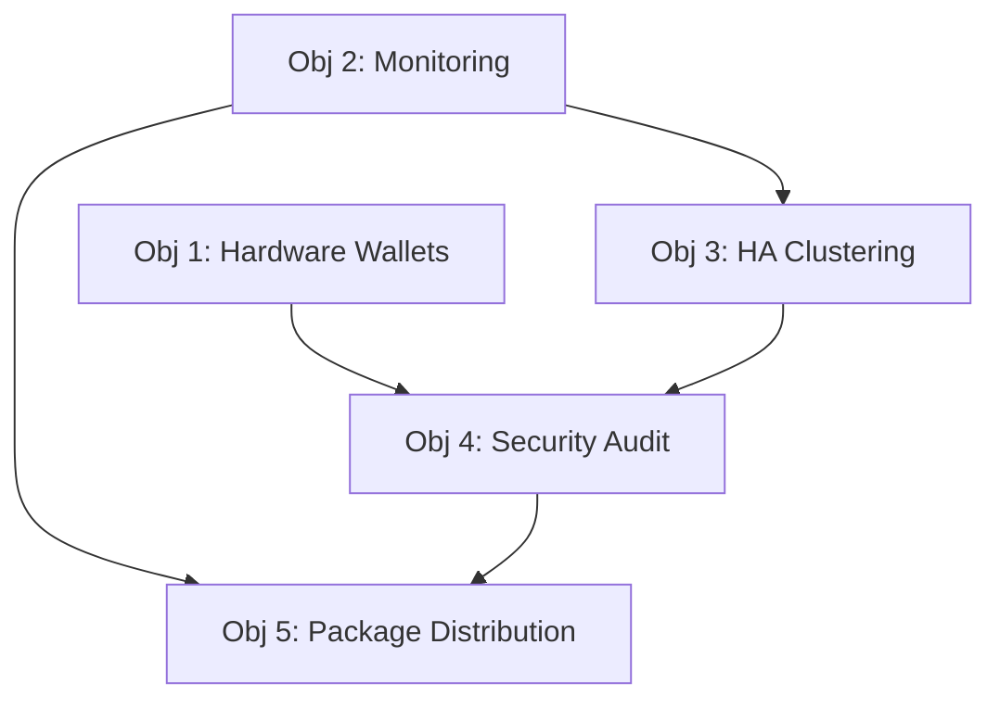

# Phase 2: Production Readiness - Comprehensive Implementation Plan

**Version:** 1.0  
**Status:** In Progress (🚧)  
**Target Completion:** Q2 2025  
**Document Owner:** Slonana Labs Development Team

## Executive Summary

Phase 2 focuses on transforming Slonana.cpp from a feature-complete validator into a production-ready, enterprise-grade blockchain infrastructure. This phase emphasizes security, reliability, monitoring, and distribution mechanisms necessary for mainnet deployment and widespread adoption.

## 📋 Phase 2 Objectives

As defined in the project README, Phase 2 encompasses five critical production readiness areas:

1. **Hardware Wallet Integration** - Support for Ledger and Trezor devices
2. **Advanced Monitoring and Alerting** - Comprehensive observability infrastructure  
3. **High-Availability Clustering** - Multi-node fault-tolerant deployments
4. **Security Audits and Penetration Testing** - Professional security validation
5. **Package Manager Distribution** - Native OS package distribution (Homebrew, APT, RPM)

## 🎯 Success Criteria

**Phase 2 Completion Requirements:**
- [ ] Hardware wallets (Ledger, Trezor) fully integrated and tested
- [ ] Production monitoring stack deployed with 99.9% uptime SLA capability
- [ ] HA cluster configurations validated in testnet environments  
- [ ] Security audit completed with all critical/high findings resolved
- [ ] Native packages available in major OS package repositories
- [ ] All deliverables documented and tested with ≥95% test coverage

## 📊 Key Performance Indicators (KPIs)

| Metric | Target | Measurement |
|--------|--------|-------------|
| Security Audit Score | ≥85/100 | Third-party assessment |
| Hardware Wallet Compatibility | 100% | Ledger Live + Trezor Suite integration |
| HA Cluster Uptime | ≥99.9% | 30-day rolling average |
| Package Install Success Rate | ≥99% | Cross-platform validation |
| Monitoring Coverage | ≥95% | Code and infrastructure metrics |

---

## 🔐 **Objective 1: Hardware Wallet Integration**

### Overview
Implement secure hardware wallet support for Ledger and Trezor devices, enabling users to interact with Slonana validators using hardware-secured private keys.

### Technical Scope
- **Ledger Integration**: Nano S, Nano S Plus, Nano X support
- **Trezor Integration**: Model T and Model One support  
- **Protocol Support**: Solana app integration via HID/WebUSB
- **Security**: No private key exposure, transaction signing verification

### Task Breakdown

#### 1.1 Research and Design (2 weeks)
**Owner:** Security Team Lead  
**Dependencies:** None  

**Tasks:**
- [ ] **1.1.1** Research Ledger SDK and Solana app APIs
- [ ] **1.1.2** Research Trezor Connect SDK integration patterns  
- [ ] **1.1.3** Design hardware wallet abstraction layer
- [ ] **1.1.4** Define transaction signing workflow
- [ ] **1.1.5** Create security requirements specification

**Deliverables:**
- Hardware wallet integration design document
- Security requirements specification
- API interface definitions

#### 1.2 Core Infrastructure (3 weeks)
**Owner:** Core Development Team  
**Dependencies:** 1.1 complete  

**Tasks:**
- [ ] **1.2.1** Implement hardware wallet abstraction interface
- [ ] **1.2.2** Create device discovery and connection management
- [ ] **1.2.3** Implement transaction serialization for hardware signing
- [ ] **1.2.4** Add hardware wallet configuration to validator config
- [ ] **1.2.5** Integrate with existing RPC authentication system

**Deliverables:**
- `src/wallet/` module with core interfaces
- Hardware wallet configuration schema
- Integration tests for device communication

#### 1.3 Ledger Integration (2 weeks)
**Owner:** Hardware Integration Specialist  
**Dependencies:** 1.2 complete  

**Tasks:**
- [ ] **1.3.1** Implement Ledger device communication layer
- [ ] **1.3.2** Integrate with Ledger Solana app
- [ ] **1.3.3** Implement transaction signing with Ledger
- [ ] **1.3.4** Add Ledger-specific error handling and recovery
- [ ] **1.3.5** Create Ledger device testing framework

**Deliverables:**
- Ledger-specific implementation
- Ledger integration tests
- Error handling documentation

#### 1.4 Trezor Integration (2 weeks)
**Owner:** Hardware Integration Specialist  
**Dependencies:** 1.2 complete  

**Tasks:**
- [ ] **1.4.1** Implement Trezor device communication layer
- [ ] **1.4.2** Integrate with Trezor Connect
- [ ] **1.4.3** Implement transaction signing with Trezor
- [ ] **1.4.4** Add Trezor-specific error handling and recovery
- [ ] **1.4.5** Create Trezor device testing framework

**Deliverables:**
- Trezor-specific implementation  
- Trezor integration tests
- Cross-device compatibility tests

#### 1.5 Testing and Documentation (2 weeks)
**Owner:** QA Team + Technical Writers  
**Dependencies:** 1.3, 1.4 complete  

**Tasks:**
- [ ] **1.5.1** Comprehensive hardware wallet testing on real devices
- [ ] **1.5.2** Create hardware wallet user documentation
- [ ] **1.5.3** Add hardware wallet examples to docs/
- [ ] **1.5.4** Update deployment guides with hardware wallet setup
- [ ] **1.5.5** Security review and penetration testing

**Deliverables:**
- Hardware wallet user guide
- Security assessment report
- Integration examples and tutorials

**Total Duration:** 11 weeks  
**Resources Required:** 2 full-time developers, 1 security specialist, 1 QA engineer

---

## 📊 **Objective 2: Advanced Monitoring and Alerting**

### Overview
Implement comprehensive production-grade monitoring, metrics collection, alerting, and observability infrastructure suitable for enterprise deployments.

### Technical Scope
- **Metrics**: Prometheus-compatible metrics export
- **Logging**: Structured logging with centralized aggregation
- **Alerting**: Multi-channel alerting (email, Slack, PagerDuty)
- **Dashboards**: Grafana dashboards for operations teams
- **Health Checks**: Deep system health validation

### Task Breakdown

#### 2.1 Metrics Infrastructure (3 weeks)
**Owner:** DevOps Team Lead  
**Dependencies:** None  

**Tasks:**
- [ ] **2.1.1** Design comprehensive metrics taxonomy
- [ ] **2.1.2** Implement Prometheus metrics exporter
- [ ] **2.1.3** Add business logic metrics (TPS, validation times, etc.)
- [ ] **2.1.4** Implement system metrics collection (CPU, memory, disk, network)
- [ ] **2.1.5** Add custom metrics for validator-specific operations

**Deliverables:**
- Metrics specification document
- Prometheus exporter implementation
- Metrics validation tests

#### 2.2 Logging Enhancement (2 weeks)
**Owner:** Core Development Team  
**Dependencies:** None  

**Tasks:**
- [ ] **2.2.1** Enhance structured logging throughout codebase
- [ ] **2.2.2** Implement log level configuration and runtime adjustment
- [ ] **2.2.3** Add correlation IDs for distributed tracing
- [ ] **2.2.4** Implement log aggregation and rotation policies
- [ ] **2.2.5** Add security event logging

**Deliverables:**
- Enhanced logging framework
- Log configuration system
- Security event log specification

#### 2.3 Alerting System (3 weeks)
**Owner:** DevOps Team + SRE  
**Dependencies:** 2.1 complete  

**Tasks:**
- [ ] **2.3.1** Design alerting rules and thresholds
- [ ] **2.3.2** Implement Alertmanager integration
- [ ] **2.3.3** Configure multi-channel alert routing
- [ ] **2.3.4** Implement alert escalation and acknowledgment
- [ ] **2.3.5** Create runbook automation for common alerts

**Deliverables:**
- Alerting rule configurations
- Multi-channel notification system
- Alert runbook documentation

#### 2.4 Observability Dashboards (2 weeks)
**Owner:** DevOps Team + UI/UX Designer  
**Dependencies:** 2.1, 2.2 complete  

**Tasks:**
- [ ] **2.4.1** Create operational dashboards for validator health
- [ ] **2.4.2** Implement business metrics dashboards
- [ ] **2.4.3** Add network topology and cluster visualizations
- [ ] **2.4.4** Create performance analysis dashboards
- [ ] **2.4.5** Implement dashboard provisioning and versioning

**Deliverables:**
- Grafana dashboard collection
- Dashboard provisioning automation
- Dashboard user documentation

#### 2.5 Health Check Framework (2 weeks)
**Owner:** Core Development Team  
**Dependencies:** 2.1, 2.2 complete  

**Tasks:**
- [ ] **2.5.1** Implement deep health check framework
- [ ] **2.5.2** Add component-specific health endpoints
- [ ] **2.5.3** Create health check aggregation and dependencies
- [ ] **2.5.4** Implement health check scheduling and caching
- [ ] **2.5.5** Add external dependency health checks

**Deliverables:**
- Health check framework
- Component health endpoints
- Health check documentation

**Total Duration:** 12 weeks  
**Resources Required:** 2 DevOps engineers, 1 SRE, 1 developer, 0.5 UI/UX designer

---

## 🏗️ **Objective 3: High-Availability Clustering**

### Overview
Design and implement high-availability clustering capabilities for production deployments requiring fault tolerance and load distribution.

### Technical Scope
- **Consensus**: Multi-node consensus and leadership election
- **Load Balancing**: RPC load distribution and failover
- **Data Replication**: Ledger data replication and synchronization
- **Network Partitioning**: Split-brain prevention and recovery
- **Rolling Updates**: Zero-downtime deployment capabilities

### Task Breakdown

#### 3.1 Cluster Architecture Design (3 weeks)
**Owner:** Systems Architect + DevOps Lead  
**Dependencies:** None  

**Tasks:**
- [ ] **3.1.1** Design cluster topology and node roles
- [ ] **3.1.2** Define consensus and leadership election mechanisms
- [ ] **3.1.3** Design data replication and consistency strategies  
- [ ] **3.1.4** Create network partitioning and split-brain prevention
- [ ] **3.1.5** Define cluster configuration and management APIs

**Deliverables:**
- Cluster architecture specification
- Consensus protocol design
- Data consistency model documentation

#### 3.2 Consensus Implementation (4 weeks)
**Owner:** Distributed Systems Team  
**Dependencies:** 3.1 complete  

**Tasks:**
- [ ] **3.2.1** Implement leader election protocol
- [ ] **3.2.2** Add cluster membership management
- [ ] **3.2.3** Implement vote coordination and consensus
- [ ] **3.2.4** Add failure detection and recovery mechanisms
- [ ] **3.2.5** Create consensus protocol testing framework

**Deliverables:**
- Consensus protocol implementation
- Leader election mechanism
- Failure detection system

#### 3.3 Data Replication (3 weeks)
**Owner:** Storage Team + Core Developers  
**Dependencies:** 3.2 complete  

**Tasks:**
- [ ] **3.3.1** Implement ledger data replication
- [ ] **3.3.2** Add state synchronization protocols
- [ ] **3.3.3** Create conflict resolution mechanisms
- [ ] **3.3.4** Implement incremental synchronization
- [ ] **3.3.5** Add replication monitoring and validation

**Deliverables:**
- Data replication system
- State synchronization protocols
- Conflict resolution framework

#### 3.4 Load Balancing and Failover (3 weeks)
**Owner:** Network Team + DevOps  
**Dependencies:** 3.2 complete  

**Tasks:**
- [ ] **3.4.1** Implement RPC load balancing
- [ ] **3.4.2** Add automatic failover mechanisms
- [ ] **3.4.3** Create session affinity and sticky connections
- [ ] **3.4.4** Implement health-based routing
- [ ] **3.4.5** Add load balancer configuration management

**Deliverables:**
- Load balancing implementation
- Automatic failover system
- Health-based routing logic

#### 3.5 Cluster Management Tools (2 weeks)
**Owner:** DevOps Team + Core Developers  
**Dependencies:** 3.2, 3.3, 3.4 complete  

**Tasks:**
- [ ] **3.5.1** Create cluster provisioning tools
- [ ] **3.5.2** Implement cluster status and monitoring
- [ ] **3.5.3** Add rolling update mechanisms
- [ ] **3.5.4** Create backup and restore procedures
- [ ] **3.5.5** Implement cluster configuration validation

**Deliverables:**
- Cluster management CLI tools
- Rolling update system
- Backup/restore procedures

#### 3.6 Testing and Validation (3 weeks)
**Owner:** QA Team + Systems Engineers  
**Dependencies:** 3.5 complete  

**Tasks:**
- [ ] **3.6.1** Create chaos engineering test suite
- [ ] **3.6.2** Implement network partition testing
- [ ] **3.6.3** Validate failure scenarios and recovery
- [ ] **3.6.4** Performance testing under load
- [ ] **3.6.5** Create cluster deployment documentation

**Deliverables:**
- Chaos engineering framework
- Cluster testing suite
- Deployment documentation

**Total Duration:** 18 weeks  
**Resources Required:** 3 distributed systems engineers, 2 DevOps engineers, 2 QA engineers

---

## 🔒 **Objective 4: Security Audits and Penetration Testing**

### Overview
Conduct comprehensive security assessment including external audits, penetration testing, and vulnerability management to ensure production-grade security posture.

### Technical Scope
- **Code Audit**: Static analysis and manual code review
- **Penetration Testing**: Network and application security testing
- **Cryptographic Review**: Cryptographic implementation validation
- **Infrastructure Security**: Deployment and operational security
- **Compliance**: Security standards and regulatory compliance

### Task Breakdown

#### 4.1 Security Audit Preparation (2 weeks)
**Owner:** Security Team Lead  
**Dependencies:** None  

**Tasks:**
- [ ] **4.1.1** Select qualified security audit firms
- [ ] **4.1.2** Define audit scope and objectives
- [ ] **4.1.3** Prepare codebase and documentation for audit
- [ ] **4.1.4** Establish audit timeline and communication protocols
- [ ] **4.1.5** Create security testing environment

**Deliverables:**
- Audit vendor selection and contracts
- Audit scope definition document
- Security testing infrastructure

#### 4.2 Static Code Analysis (3 weeks)
**Owner:** Security Team + External Auditors  
**Dependencies:** 4.1 complete  

**Tasks:**
- [ ] **4.2.1** Automated static analysis with multiple tools
- [ ] **4.2.2** Manual code review focusing on critical paths
- [ ] **4.2.3** Cryptographic implementation review
- [ ] **4.2.4** Input validation and sanitization audit
- [ ] **4.2.5** Memory safety and buffer overflow analysis

**Deliverables:**
- Static analysis report
- Code review findings
- Cryptographic security assessment

#### 4.3 Dynamic Security Testing (3 weeks)
**Owner:** Penetration Testing Team (External)  
**Dependencies:** 4.1 complete  

**Tasks:**
- [ ] **4.3.1** Network penetration testing
- [ ] **4.3.2** Application-layer security testing
- [ ] **4.3.3** API security and authentication testing
- [ ] **4.3.4** Consensus mechanism attack vectors
- [ ] **4.3.5** Side-channel and timing attack analysis

**Deliverables:**
- Penetration testing report
- Vulnerability assessment
- Attack vector documentation

#### 4.4 Infrastructure Security Review (2 weeks)
**Owner:** DevOps Security Team  
**Dependencies:** 4.1 complete  

**Tasks:**
- [ ] **4.4.1** Container and deployment security audit
- [ ] **4.4.2** Network security configuration review
- [ ] **4.4.3** Access control and privilege escalation testing
- [ ] **4.4.4** Secrets management and key handling audit
- [ ] **4.4.5** Supply chain security assessment

**Deliverables:**
- Infrastructure security report
- Deployment security guidelines
- Supply chain risk assessment

#### 4.5 Vulnerability Remediation (4 weeks)
**Owner:** Core Development Team + Security Team  
**Dependencies:** 4.2, 4.3, 4.4 complete  

**Tasks:**
- [ ] **4.5.1** Prioritize findings by severity and impact
- [ ] **4.5.2** Implement fixes for critical and high severity issues
- [ ] **4.5.3** Create security patches and testing procedures
- [ ] **4.5.4** Update security documentation and procedures
- [ ] **4.5.5** Conduct fix verification and re-testing

**Deliverables:**
- Vulnerability remediation plan
- Security patches and fixes
- Updated security documentation

#### 4.6 Compliance and Certification (2 weeks)
**Owner:** Compliance Team + Legal  
**Dependencies:** 4.5 complete  

**Tasks:**
- [ ] **4.6.1** Security standards compliance assessment
- [ ] **4.6.2** Create security compliance documentation
- [ ] **4.6.3** Implement continuous security monitoring
- [ ] **4.6.4** Establish incident response procedures
- [ ] **4.6.5** Security certification preparation

**Deliverables:**
- Compliance assessment report
- Security certification documentation
- Incident response procedures

**Total Duration:** 16 weeks  
**Resources Required:** 2 internal security engineers, 3-4 external auditors, 2 developers for remediation

---

## 📦 **Objective 5: Package Manager Distribution**

### Overview
Create and distribute native OS packages through major package managers (Homebrew, APT, RPM) and package repositories to enable easy installation and updates.

### Technical Scope
- **Homebrew**: macOS package distribution
- **APT**: Debian/Ubuntu package distribution  
- **RPM**: CentOS/RHEL/Fedora package distribution
- **Windows**: Chocolatey package distribution
- **CI/CD**: Automated package building and publishing

### Task Breakdown

#### 5.1 Package Infrastructure Setup (2 weeks)
**Owner:** DevOps Team + Release Engineer  
**Dependencies:** None  

**Tasks:**
- [ ] **5.1.1** Design package repository architecture
- [ ] **5.1.2** Set up package signing infrastructure
- [ ] **5.1.3** Create package repository hosting
- [ ] **5.1.4** Implement package version management
- [ ] **5.1.5** Set up automated package testing

**Deliverables:**
- Package repository infrastructure
- Package signing system
- Version management strategy

#### 5.2 Homebrew Integration (2 weeks)
**Owner:** macOS Specialist + DevOps  
**Dependencies:** 5.1 complete  

**Tasks:**
- [ ] **5.2.1** Create Homebrew formula for slonana-validator
- [ ] **5.2.2** Set up automated Homebrew package building
- [ ] **5.2.3** Implement Homebrew tap repository
- [ ] **5.2.4** Add macOS-specific installation scripts
- [ ] **5.2.5** Create Homebrew package testing automation

**Deliverables:**
- Homebrew formula and tap
- macOS package automation
- Installation validation tests

#### 5.3 Debian/Ubuntu APT Packages (3 weeks)
**Owner:** Linux Packaging Specialist  
**Dependencies:** 5.1 complete  

**Tasks:**
- [ ] **5.3.1** Create Debian package control files
- [ ] **5.3.2** Implement systemd service integration
- [ ] **5.3.3** Set up APT repository and signing
- [ ] **5.3.4** Create installation and upgrade scripts
- [ ] **5.3.5** Add multi-architecture build support

**Deliverables:**
- Debian packages for multiple architectures
- APT repository infrastructure
- systemd service integration

#### 5.4 RPM Package Distribution (3 weeks)
**Owner:** Linux Packaging Specialist  
**Dependencies:** 5.1 complete  

**Tasks:**
- [ ] **5.4.1** Create RPM spec files and build scripts
- [ ] **5.4.2** Implement systemd service integration for RPM
- [ ] **5.4.3** Set up YUM/DNF repository infrastructure
- [ ] **5.4.4** Create installation and upgrade automation
- [ ] **5.4.5** Add RHEL/CentOS/Fedora compatibility testing

**Deliverables:**
- RPM packages for major distributions
- YUM/DNF repository setup
- Distribution compatibility matrix

#### 5.5 Windows Chocolatey Package (2 weeks)
**Owner:** Windows Specialist  
**Dependencies:** 5.1 complete  

**Tasks:**
- [ ] **5.5.1** Create Chocolatey package specification
- [ ] **5.5.2** Implement Windows service integration
- [ ] **5.5.3** Set up automated Windows package building
- [ ] **5.5.4** Create Windows installation and configuration scripts
- [ ] **5.5.5** Add Windows package testing automation

**Deliverables:**
- Chocolatey package and scripts
- Windows service integration
- Windows installation automation

#### 5.6 CI/CD Integration and Testing (2 weeks)
**Owner:** DevOps Team + QA  
**Dependencies:** 5.2, 5.3, 5.4, 5.5 complete  

**Tasks:**
- [ ] **5.6.1** Integrate package building into CI/CD pipeline
- [ ] **5.6.2** Implement automated package testing across platforms
- [ ] **5.6.3** Create package deployment automation
- [ ] **5.6.4** Set up package update and rollback procedures
- [ ] **5.6.5** Add package security scanning and validation

**Deliverables:**
- Automated package CI/CD pipeline
- Cross-platform testing framework
- Package deployment automation

**Total Duration:** 14 weeks  
**Resources Required:** 2 packaging specialists, 1 DevOps engineer, 1 QA engineer

---

## 📅 **Phase 2 Timeline and Milestones**

### Critical Path Analysis

The Phase 2 implementation follows a carefully planned sequence with overlapping workstreams to optimize delivery time while managing dependencies.

### Timeline Overview (24 weeks total)

```
Week:  1  2  3  4  5  6  7  8  9 10 11 12 13 14 15 16 17 18 19 20 21 22 23 24
Obj 1: ████████████████████████████████████████████
Obj 2: ████████████████████████████████████████████████████
Obj 3: ██████████████████████████████████████████████████████████████████████
Obj 4:    ████████████████████████████████████████████████████████████
Obj 5:                      ████████████████████████████████████████
```

### Major Milestones

| Milestone | Week | Deliverables | Success Criteria |
|-----------|------|--------------|------------------|
| **M1: Security Foundation** | 6 | Hardware wallet integration design, Security audit initiation | Design approved, audit contracts signed |
| **M2: Monitoring MVP** | 8 | Basic monitoring and alerting operational | Metrics collection, basic alerts functional |
| **M3: Hardware Wallet Beta** | 11 | Ledger and Trezor integration complete | Hardware signing functional on testnet |
| **M4: HA Architecture** | 14 | Cluster design and consensus implementation | Multi-node consensus operational |
| **M5: Package Distribution Alpha** | 16 | Native packages for major platforms | Packages installable via package managers |
| **M6: Security Clearance** | 18 | Security audit complete, critical issues resolved | Audit passed with acceptable risk profile |
| **M7: Production HA** | 22 | High-availability clustering production-ready | HA deployment validated in testnet |
| **M8: Phase 2 Complete** | 24 | All objectives delivered and documented | Full production readiness achieved |

### Resource Allocation by Week

| Team | Weeks 1-6 | Weeks 7-12 | Weeks 13-18 | Weeks 19-24 |
|------|-----------|------------|-------------|-------------|
| **Core Development** | 3 FTE | 4 FTE | 3 FTE | 2 FTE |
| **DevOps/SRE** | 2 FTE | 3 FTE | 3 FTE | 2 FTE |
| **Security** | 2 FTE | 2 FTE | 4 FTE | 2 FTE |
| **QA/Testing** | 1 FTE | 2 FTE | 3 FTE | 2 FTE |
| **External Contractors** | 0 FTE | 1 FTE | 3 FTE | 1 FTE |

---

## 🔄 **Dependencies and Risk Management**

### Inter-Objective Dependencies



### Critical Dependencies

1. **Security Audit Dependencies**
   - Hardware wallet integration must be feature-complete
   - HA clustering implementation must be testable
   - Monitoring infrastructure needed for security validation

2. **Package Distribution Dependencies**
   - Security audit must pass for production packages
   - Monitoring integration required for package health checks

3. **External Dependencies**
   - Third-party security audit firm availability
   - Package repository approval processes
   - Hardware wallet SDK updates and compatibility

### Risk Assessment and Mitigation

| Risk | Probability | Impact | Mitigation Strategy |
|------|-------------|--------|-------------------|
| **Security audit failure** | Medium | High | Early security review, incremental fixes, backup audit firm |
| **Hardware wallet SDK incompatibility** | Low | Medium | Early prototyping, SDK vendor communication, fallback options |
| **HA consensus complexity** | Medium | High | Incremental implementation, expert consultation, proven algorithms |
| **Package approval delays** | Medium | Low | Early submission, maintainer relationships, alternative channels |
| **Resource availability** | Medium | Medium | Cross-training, contractor backup, scope flexibility |

### Contingency Plans

1. **Timeline Extension**: If critical issues arise, Phase 2 can extend to 28 weeks with milestone adjustments
2. **Scope Reduction**: Non-critical features can be moved to Phase 2.1 if needed
3. **Resource Escalation**: Additional contractor resources identified for critical path acceleration
4. **Parallel Development**: Some objectives can run in parallel with adjusted resource allocation

---

## 🎯 **Success Metrics and Validation**

### Quantitative Success Metrics

| Category | Metric | Target | Measurement Method |
|----------|--------|--------|--------------------|
| **Security** | Audit Score | ≥85/100 | Third-party security audit |
| **Reliability** | HA Uptime | ≥99.9% | 30-day monitoring in testnet |
| **Compatibility** | Hardware Wallet Support | 100% | Ledger Live + Trezor Suite integration |
| **Distribution** | Package Install Success | ≥99% | Automated cross-platform testing |
| **Monitoring** | Metric Coverage | ≥95% | Code instrumentation analysis |
| **Performance** | Cluster Failover Time | <30 seconds | Automated failover testing |

### Qualitative Success Criteria

1. **Enterprise Readiness**: Infrastructure capable of supporting enterprise deployments
2. **Security Posture**: Professional security validation with acceptable risk profile
3. **Operational Excellence**: Comprehensive monitoring and alerting for production operations
4. **User Experience**: Simplified installation and configuration for end users
5. **Documentation Quality**: Complete documentation enabling self-service deployment

### Validation Process

1. **Internal Testing** (Weeks 20-22): Comprehensive internal validation of all objectives
2. **Testnet Deployment** (Weeks 22-23): Full Phase 2 feature deployment to public testnet
3. **Community Beta** (Week 24): Limited community beta testing with feedback collection
4. **Production Readiness Review** (Week 24): Final go/no-go decision for mainnet readiness

---

## 📋 **Implementation Checklist**

### Pre-Implementation Setup
- [ ] Team assignments and role definitions
- [ ] Development environment standardization
- [ ] Communication protocols and tools setup
- [ ] External vendor selection and contracting
- [ ] Budget approval and resource allocation

### Week 1-6: Foundation Phase
- [ ] Hardware wallet design completion
- [ ] Security audit vendor selection
- [ ] Monitoring infrastructure design
- [ ] Cluster architecture specification
- [ ] Package infrastructure setup

### Week 7-12: Development Phase
- [ ] Hardware wallet core implementation
- [ ] Monitoring system deployment
- [ ] Consensus mechanism implementation
- [ ] Security audit initiation
- [ ] Package format development

### Week 13-18: Integration Phase
- [ ] Hardware wallet device integration
- [ ] HA clustering integration
- [ ] Security testing and fixes
- [ ] Package testing and validation
- [ ] Comprehensive integration testing

### Week 19-24: Validation Phase
- [ ] Security audit completion
- [ ] HA cluster production testing
- [ ] Package distribution setup
- [ ] Documentation and training
- [ ] Phase 2 completion validation

---

## 📚 **Documentation and Training Plan**

### Documentation Deliverables

1. **User Documentation**
   - Hardware wallet setup and usage guide
   - HA cluster deployment guide
   - Package installation instructions
   - Monitoring and alerting configuration

2. **Operator Documentation**
   - Production deployment runbooks
   - Monitoring and alerting response procedures
   - Security incident response plans
   - Backup and recovery procedures

3. **Developer Documentation**
   - Hardware wallet API documentation
   - Monitoring integration guide
   - Cluster architecture documentation
   - Security best practices guide

### Training Requirements

1. **Operations Team Training** (2 weeks)
   - HA cluster management
   - Monitoring and alerting systems
   - Incident response procedures
   - Security operational practices

2. **Development Team Training** (1 week)
   - Hardware wallet integration patterns
   - Security development practices
   - Monitoring instrumentation
   - Cluster development guidelines

---

## 🔄 **Post-Phase 2 Considerations**

### Transition to Phase 3

Phase 2 completion establishes the foundation for Phase 3 (Proof-of-Work Integration):

- **Security Foundation**: Security audit and hardening prepare for PoW security requirements
- **HA Infrastructure**: Clustering capabilities essential for PoW mining coordination
- **Monitoring**: Advanced monitoring crucial for PoW network health
- **Distribution**: Package distribution enables PoW miner software distribution

### Maintenance and Evolution

- **Continuous Security**: Quarterly security reviews and updates
- **Monitoring Enhancement**: Ongoing monitoring improvements based on operational feedback
- **Package Updates**: Regular package updates and security patches
- **HA Optimization**: Cluster performance optimization based on production metrics

### Success Criteria Review

Phase 2 success will be measured by:
1. **Security Clearance**: Professional security audit passed
2. **Production Deployment**: Enterprise customers successfully deploying HA clusters
3. **Community Adoption**: Significant increase in validator deployments via packages
4. **Operational Excellence**: 99.9%+ uptime achieved in production deployments

---

**Document Status:** Living Document - Updated as Phase 2 progresses  
**Next Review:** Bi-weekly during implementation  
**Stakeholder Approval Required:** Development Lead, Security Lead, DevOps Lead, Product Owner

---

*This plan represents the comprehensive roadmap for achieving production readiness in Phase 2. Regular reviews and updates ensure alignment with project goals and market requirements.*