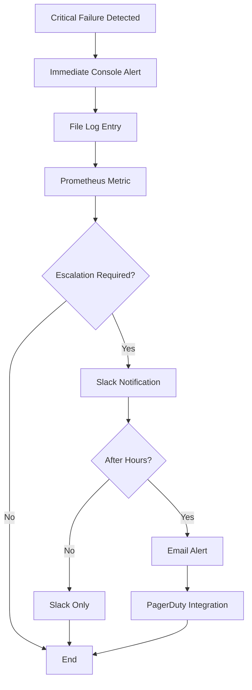

# Alerting Setup and Configuration Guide

## Overview

The Slonana.cpp validator implements a multi-channel alerting system designed to provide immediate notification of critical failures. This guide covers setup, configuration, and operational procedures for the alerting infrastructure.

## Alert Channel Types

### 1. Console Alerts
**Purpose**: Development and debugging  
**Latency**: Immediate  
**Reliability**: High (local)

```cpp
// Enable console alerts
logger.add_alert_channel(AlertChannelFactory::create_console_channel(true));
```

**Output Format**:
```
🚨 CRITICAL ALERT 🚨
Module: network
Message: Gossip protocol disconnected
Time: 2025-09-20 09:58:34
Error Code: NET_GOSSIP_001
Context:
  peer_count: 0
  last_message: 30s
========================
```

### 2. File-based Alerts
**Purpose**: Persistent alert storage and audit trail  
**Latency**: <1ms  
**Reliability**: High (local disk)

```cpp
// Configure file alerting
std::string alert_file = "/var/log/slonana/critical_alerts.log";
logger.add_alert_channel(AlertChannelFactory::create_file_channel(alert_file, true));
```

**Setup Requirements**:
```bash
# Create log directory
sudo mkdir -p /var/log/slonana
sudo chown slonana:slonana /var/log/slonana
sudo chmod 755 /var/log/slonana

# Configure log rotation
sudo cat > /etc/logrotate.d/slonana << EOF
/var/log/slonana/*.log {
    daily
    rotate 30
    compress
    delaycompress
    missingok
    notifempty
    create 644 slonana slonana
}
EOF
```

### 3. Slack Integration
**Purpose**: Team notifications and collaboration  
**Latency**: 1-5 seconds  
**Reliability**: Medium (depends on Slack availability)

#### Setup Instructions

1. **Create Slack Webhook**:
   - Go to https://api.slack.com/apps
   - Create new app → "From scratch"
   - Select workspace and app name
   - Navigate to "Incoming Webhooks"
   - Activate and create webhook for target channel

2. **Configure Environment**:
   ```bash
   export SLONANA_SLACK_WEBHOOK_URL="https://hooks.slack.com/services/YOUR/WEBHOOK/URL"
   export SLONANA_SLACK_CHANNEL="#alerts"
   export SLONANA_SLACK_USERNAME="Slonana Validator"
   ```

3. **Code Integration**:
   ```cpp
   if (const char* webhook_url = std::getenv("SLONANA_SLACK_WEBHOOK_URL")) {
       logger.add_alert_channel(AlertChannelFactory::create_slack_channel(webhook_url, true));
   }
   ```

**Message Format**:
```json
{
  "channel": "#alerts",
  "username": "Slonana Validator",
  "icon_emoji": ":warning:",
  "text": ":warning: *CRITICAL FAILURE DETECTED* :warning:\n*Module:* network\n*Message:* Gossip protocol disconnected\n*Error Code:* NET_GOSSIP_001\n*Time:* 2025-09-20 09:58:34 UTC\n*Context:*\n• peer_count: 0\n• last_message: 30s"
}
```

### 4. Email Alerts
**Purpose**: Escalation and off-hours notification  
**Latency**: 5-30 seconds  
**Reliability**: High (SMTP infrastructure)

#### Setup Instructions

1. **Configure SMTP Settings**:
   ```bash
   export SLONANA_SMTP_SERVER="smtp.gmail.com"
   export SLONANA_SMTP_PORT="587"
   export SLONANA_SMTP_USERNAME="validator@example.com"
   export SLONANA_SMTP_PASSWORD="app_specific_password"
   export SLONANA_ALERT_EMAIL_FROM="validator@example.com"
   export SLONANA_ALERT_EMAIL_TO="oncall@example.com"
   ```

2. **Gmail Setup** (if using Gmail):
   - Enable 2-factor authentication
   - Generate app-specific password
   - Use app password in `SLONANA_SMTP_PASSWORD`

3. **Code Integration**:
   ```cpp
   const char* smtp_server = std::getenv("SLONANA_SMTP_SERVER");
   const char* smtp_port_str = std::getenv("SLONANA_SMTP_PORT");
   const char* username = std::getenv("SLONANA_SMTP_USERNAME");
   const char* password = std::getenv("SLONANA_SMTP_PASSWORD");
   const char* from_email = std::getenv("SLONANA_ALERT_EMAIL_FROM");
   const char* to_email = std::getenv("SLONANA_ALERT_EMAIL_TO");
   
   if (smtp_server && username && password && from_email && to_email) {
       int port = smtp_port_str ? std::atoi(smtp_port_str) : 587;
       logger.add_alert_channel(AlertChannelFactory::create_email_channel(
           smtp_server, port, username, password, from_email, to_email, true
       ));
   }
   ```

### 5. Prometheus Metrics
**Purpose**: Integration with monitoring systems  
**Latency**: Real-time  
**Reliability**: High (local metrics)

```cpp
// Enable Prometheus metrics alerting
logger.add_alert_channel(AlertChannelFactory::create_prometheus_channel(true));
```

**Exposed Metrics**:
```prometheus
# Critical failure counters by module
critical_failures_total{module="network"} 5
critical_failures_total{module="consensus"} 2
critical_failures_total{module="svm"} 1
critical_failures_total{module="validator"} 0
critical_failures_total{module="ledger"} 0

# Alert processing metrics
alerts_sent_total{channel="console"} 8
alerts_sent_total{channel="file"} 8
alerts_sent_total{channel="slack"} 6
alerts_sent_total{channel="email"} 2
alerts_failed_total{channel="slack"} 1
```

## Alert Rules and Thresholds

### Critical Alert Triggers

| Module | Error Code | Description | Auto-Recovery |
|--------|------------|-------------|---------------|
| Network | NET_GOSSIP_001 | Gossip disconnection | Retry after 30s |
| Network | NET_RPC_001 | RPC server failure | Restart required |
| Consensus | CON_FORK_001 | Fork choice deadlock | Manual intervention |
| SVM | SVM_EXEC_001 | Program timeout | Transaction dropped |
| Ledger | LED_CORRUPT_001 | Data corruption | Snapshot restore |
| Validator | VAL_INIT_001 | Startup failure | Manual restart |

### Alert Escalation Policy



## Production Deployment

### Docker Configuration

```dockerfile
# Add alerting configuration to Dockerfile
ENV SLONANA_LOG_LEVEL=INFO
ENV SLONANA_LOG_FORMAT=json
ENV SLONANA_LOG_ASYNC=true

# Mount alert configuration
VOLUME ["/var/log/slonana"]
COPY alerting.conf /etc/slonana/alerting.conf
```

### Kubernetes Deployment

```yaml
apiVersion: apps/v1
kind: Deployment
metadata:
  name: slonana-validator
spec:
  template:
    spec:
      containers:
      - name: validator
        image: slonana/validator:latest
        env:
        - name: SLONANA_LOG_LEVEL
          value: "INFO"
        - name: SLONANA_SLACK_WEBHOOK_URL
          valueFrom:
            secretKeyRef:
              name: slonana-secrets
              key: slack-webhook-url
        volumeMounts:
        - name: logs
          mountPath: /var/log/slonana
        - name: config
          mountPath: /etc/slonana
      volumes:
      - name: logs
        persistentVolumeClaim:
          claimName: slonana-logs
      - name: config
        configMap:
          name: slonana-config
```

### SystemD Service

```ini
[Unit]
Description=Slonana Validator
After=network.target

[Service]
Type=simple
User=slonana
Group=slonana
WorkingDirectory=/opt/slonana
ExecStart=/opt/slonana/bin/slonana_validator --config /etc/slonana/validator.conf
Restart=always
RestartSec=10

# Logging configuration
Environment=SLONANA_LOG_LEVEL=INFO
Environment=SLONANA_LOG_FORMAT=json
Environment=SLONANA_LOG_ASYNC=true

# Alert configuration
EnvironmentFile=-/etc/slonana/alerting.env

[Install]
WantedBy=multi-user.target
```

### Alert Configuration File

```bash
# /etc/slonana/alerting.env
SLONANA_SLACK_WEBHOOK_URL=https://hooks.slack.com/services/YOUR/WEBHOOK/URL
SLONANA_SLACK_CHANNEL=#validator-alerts
SLONANA_ALERT_EMAIL_TO=oncall@example.com
SLONANA_SMTP_SERVER=smtp.example.com
SLONANA_SMTP_PORT=587
SLONANA_SMTP_USERNAME=alerts@example.com
SLONANA_SMTP_PASSWORD=secure_password
```

## Monitoring and Observability

### Grafana Dashboard

```json
{
  "dashboard": {
    "title": "Slonana Validator Alerts",
    "panels": [
      {
        "title": "Critical Failures by Module",
        "type": "stat",
        "targets": [
          {
            "expr": "increase(critical_failures_total[5m])",
            "legendFormat": "{{module}}"
          }
        ]
      },
      {
        "title": "Alert Channel Health",
        "type": "table",
        "targets": [
          {
            "expr": "alerts_sent_total",
            "legendFormat": "{{channel}}"
          },
          {
            "expr": "alerts_failed_total",
            "legendFormat": "{{channel}}_failed"
          }
        ]
      }
    ]
  }
}
```

### AlertManager Rules

```yaml
# alertmanager.yml
groups:
- name: slonana_validator
  rules:
  - alert: ValidatorCriticalFailure
    expr: increase(critical_failures_total[1m]) > 0
    for: 0s
    labels:
      severity: critical
      service: slonana-validator
    annotations:
      summary: "Critical failure in Slonana validator"
      description: "Module {{ $labels.module }} has reported a critical failure"

  - alert: HighErrorRate
    expr: rate(log_messages_total{level="error"}[5m]) > 10
    for: 2m
    labels:
      severity: warning
      service: slonana-validator
    annotations:
      summary: "High error rate in Slonana validator"
      description: "Error rate is {{ $value }} errors/second"
```

## Testing and Validation

### Alert Testing

```bash
# Test console alerts
echo "Testing console alerts..."
./slonana_validator --test-alerts console

# Test file alerts
echo "Testing file alerts..."
./slonana_validator --test-alerts file

# Test Slack integration
echo "Testing Slack alerts..."
export SLONANA_SLACK_WEBHOOK_URL="your_webhook_url"
./slonana_validator --test-alerts slack

# Test all channels
echo "Testing all alert channels..."
./slonana_validator --test-alerts all
```

### Synthetic Failures

```cpp
// Inject test critical failures
LOG_NETWORK_ERROR("Test network failure", "NET_TEST_001", 
                  {{"test", "true"}, {"severity", "critical"}});

LOG_CONSENSUS_ERROR("Test consensus failure", "CON_TEST_001");

LOG_SVM_ERROR("Test SVM failure", "SVM_TEST_001");
```

### Health Checks

```bash
#!/bin/bash
# health_check.sh

# Check if alerts are being generated
RECENT_ALERTS=$(find /var/log/slonana -name "*.log" -mmin -5 | wc -l)
if [ $RECENT_ALERTS -eq 0 ]; then
    echo "WARNING: No recent alert activity"
fi

# Check Slack connectivity
curl -X POST $SLONANA_SLACK_WEBHOOK_URL \
    -H 'Content-type: application/json' \
    --data '{"text":"Health check from Slonana validator"}' \
    --max-time 10

# Check email configuration
echo "Test alert" | mail -s "Slonana Health Check" $SLONANA_ALERT_EMAIL_TO
```

## Troubleshooting

### Common Issues

**Slack Webhooks Not Working**
```bash
# Test webhook manually
curl -X POST "$SLONANA_SLACK_WEBHOOK_URL" \
    -H 'Content-type: application/json' \
    --data '{"text":"Test message"}'

# Check webhook URL format
echo $SLONANA_SLACK_WEBHOOK_URL | grep -E '^https://hooks\.slack\.com/services/[A-Z0-9]+/[A-Z0-9]+/[A-Za-z0-9]+'
```

**Email Alerts Not Sending**
```bash
# Test SMTP connectivity
telnet $SLONANA_SMTP_SERVER $SLONANA_SMTP_PORT

# Check authentication
openssl s_client -starttls smtp -connect $SLONANA_SMTP_SERVER:$SLONANA_SMTP_PORT
```

**High Alert Volume**
```bash
# Check alert frequency
grep "CRITICAL" /var/log/slonana/critical_alerts.log | tail -100 | cut -d' ' -f1-2 | sort | uniq -c

# Implement rate limiting
export SLONANA_ALERT_RATE_LIMIT=10  # max 10 alerts per minute
```

### Debug Commands

```bash
# Monitor alert channels in real-time
tail -f /var/log/slonana/critical_alerts.log

# Check alert channel status
systemctl status slonana-validator | grep -i alert

# Validate configuration
slonana_validator --validate-config --dry-run
```

## Security Best Practices

### Secrets Management
- Store webhook URLs and passwords in secure vaults
- Use environment files with restricted permissions (600)
- Rotate credentials regularly
- Audit access to alert configurations

### Network Security
- Use TLS for all external alert channels
- Whitelist IP addresses for SMTP servers
- Implement webhook signature validation
- Monitor for alert channel abuse

### Access Control
```bash
# Secure alert configuration
sudo chown root:slonana /etc/slonana/alerting.env
sudo chmod 640 /etc/slonana/alerting.env

# Secure log files
sudo chown slonana:slonana /var/log/slonana/
sudo chmod 755 /var/log/slonana/
sudo chmod 644 /var/log/slonana/*.log
```

---

*This document is part of the Slonana.cpp comprehensive logging and alerting implementation (Issue #92).*